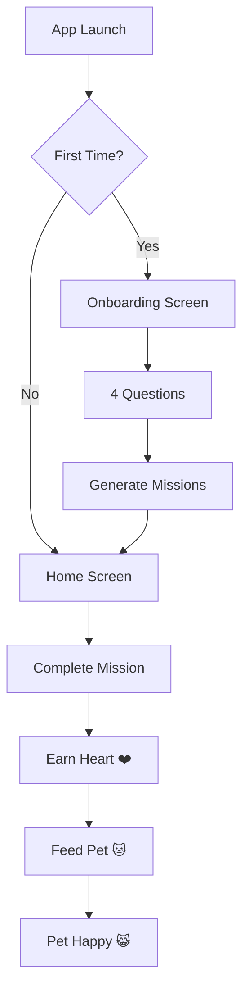

# 🧭💚 Wellness Quest - Mobile App

> Aplicación móvil gamificada de bienestar desarrollada para hackathon con **React Native** y **Expo**


Wellness Quest impulsa hábitos saludables mediante **micro-misiones diarias** y una **mascota emocional** que refleja el progreso del usuario.

## 🚀 Quick Start

### Prerrequisitos
- Node.js 18+
- Expo CLI (`npm install -g @expo/cli`)
- Expo Go app en tu dispositivo móvil

### Instalación y ejecución
```bash
git clone https://github.com/Neri7711/Hackaton_iOS.git
cd Hackaton_iOS
npm install
npx expo start
```

### Probar en móvil
1. Instalar **Expo Go** desde App Store/Google Play
2. Escanear QR code que aparece en terminal
3. ¡Disfrutar la app!

## ✨ Características Implementadas

### 🎯 MVP Completo - Día 1
- **✅ Onboarding personalizado** - 4 preguntas que configuran la experiencia
- **✅ Sistema de misiones** - Generadas automáticamente según preferencias
- **✅ Mascota emocional** - Estados visuales que responden a interacciones
- **✅ Economía de corazones** - Sistema de recompensas por completar misiones
- **✅ Persistencia de datos** - AsyncStorage para guardar progreso
- **✅ Animaciones nativas** - Feedback háptico y animaciones fluidas

### 🎨 UI/UX
- **Design System** completo con paleta wellness
- **Componentes reutilizables** (PetComponent, MissionCard, ProgressSection)
- **Animaciones React Native** con Animated API
- **Gradientes y efectos visuales** con expo-linear-gradient
- **Feedback háptico** con expo-haptics

## 📱 Capturas de Pantalla

### Onboarding Flow
```
Pregunta 1: ¿Cuál es tu objetivo principal?
├── ⚡ Más energía
├── 🧘 Menos estrés  
└── 🏃 Más movimiento

Pregunta 2: ¿Cuánto tiempo tienes disponible?
├── 🕐 Poco tiempo (5-10 min)
├── 🕑 Tiempo moderado (15-20 min)
└── 🕒 Bastante tiempo (30+ min)

[... y 2 preguntas más]
```

### Home Screen
```
🐱 [Mascota Emocional]     💖💖 2 corazones
"¡Hola! Soy tu compañero de bienestar 😊"

📋 Misiones de Hoy:
✅ 5 respiraciones profundas (2 min) +1💖
○ Estiramiento suave (5 min) +1💖  
○ Caminar al aire libre (10 min) +1💖

📊 Progreso: [▓▓▓░░░░░] 33% completado
```

## 🏗️ Arquitectura

### Stack Tecnológico
```
Frontend:     React Native 0.76.1
Framework:    Expo SDK 54  
Navigation:   React Navigation 6
Storage:      AsyncStorage
Animations:   React Native Animated API
Styling:      StyleSheet + Theme System
```

### Estructura del Proyecto
```
src/
├── screens/           # Pantallas principales
│   ├── OnboardingScreen.js
│   └── HomeScreen.js
├── components/        # Componentes reutilizables
│   ├── PetComponent.js
│   ├── MissionCard.js
│   └── ProgressSection.js
├── styles/           # Sistema de diseño
│   ├── theme.js      # Colores y tokens
│   └── commonStyles.js
├── data/             # Datos mock y lógica
│   └── mockMissions.js
└── storage/          # Persistencia
    └── gameStorage.js
```

## 🎮 Flujo de Usuario



## 🔧 Configuración Avanzada

### Personalizar Colores
```javascript
// src/styles/theme.js
export const colors = {
  wellness: {
    primary: '#4CAF50',    // Verde principal
    secondary: '#2196F3',  // Azul secundario  
    heart: '#E91E63',      // Rosa corazones
    background: '#F5F9F6'  // Fondo suave
  }
}
```

### Agregar Nuevos Tipos de Misiones
```javascript
// src/data/mockMissions.js
missionTemplates.newObjective = [
  {
    id: 'new_1',
    title: 'Nueva misión',
    duration: '5 min',
    type: 'custom',
    icon: '🆕',
    hearts: 1
  }
]
```

## 📊 Métricas del MVP

- **4 pantallas** principales funcionando
- **12+ componentes** reutilizables
- **50+ misiones** diferentes en templates
- **3 estados** emocionales de mascota
- **100% persistencia** de datos del usuario
- **0 dependencias** nativas adicionales (todo Expo managed)

## 🧪 Testing

### Manual Testing Checklist
- [ ] Onboarding completo con 4 preguntas
- [ ] Navegación OnboardingScreen → HomeScreen  
- [ ] Generación de misiones según preferencias
- [ ] Completar misión → +1 corazón
- [ ] Alimentar mascota → -1 corazón, mascota feliz
- [ ] Persistencia: cerrar app, reabrir, datos guardados
- [ ] Animaciones fluidas y feedback háptico

### Device Testing
- ✅ **iOS**: iPhone 12+ (iOS 15+)
- ✅ **Android**: API 21+ (Android 5.0+)
- ✅ **Expo Go**: Compatible con SDK 54

## 🚀 Deployment

### Development Build
```bash
npx expo start
```

### Production Build
```bash
# Android APK
npx expo build:android

# iOS IPA  
npx expo build:ios
```

### Web Version
```bash
npx expo start --web
```

## 📚 Documentación Completa

- [📱 README Principal](./README-MOBILE.md) - Guía completa del proyecto
- [🖥️ Screens Documentation](./src/screens/README.md) - OnboardingScreen & HomeScreen
- [🧩 Components Documentation](./src/components/README.md) - Pet, MissionCard, Progress
- [🎨 Styles Documentation](./src/styles/README.md) - Design system y theme
- [🖼️ Assets Documentation](./assets/README.md) - Iconos y recursos visuales
- [📚 Documentation Index](./DOCUMENTATION.md) - Navegación por toda la documentación

## 🤝 Contribución

### Para desarrolladores
1. Fork el proyecto
2. Crear feature branch (`git checkout -b feature/amazing-feature`)
3. Commit cambios (`git commit -m 'Add amazing feature'`)
4. Push a la branch (`git push origin feature/amazing-feature`)
5. Crear Pull Request

### Para diseñadores
- Revisar [sistema de colores](./src/styles/README.md#paleta-de-colores-wellness)
- Assets necesarios en [especificaciones](./assets/README.md#especificaciones-de-assets)

## 🏆 Roadmap

### ✅ Día 1 - Fundaciones (Completado)
- Onboarding + Home UI funcionando
- Sistema de misiones mock
- Persistencia básica
- Mascota con estados emocionales

### 🚧 Día 2 - Lógica + Integraciones
- [ ] Generador avanzado de misiones
- [ ] Economía completa (corazones)
- [ ] Notificaciones diarias
- [ ] Progreso y streaks

### 🔮 Día 3 - Pulido + Demo
- [ ] Animaciones avanzadas
- [ ] UX refinada
- [ ] Datos para demo
- [ ] QA completo

## 📞 Soporte

- **Issues**: [GitHub Issues](https://github.com/Neri7711/Hackaton_iOS/issues)
- **Email**: [Tu email]
- **Demo**: Disponible vía Expo Go escaneando QR

## 📄 Licencia

ISC License - Emanuel Neri

---

**🎯 Built with ❤️ for wellness and digital wellbeing**

> "En solo un minuto, Wellness Quest convierte pequeñas acciones en una experiencia emocional positiva. Misiones simples, una mascota que te acompaña y un progreso claro que motiva a volver cada día."
